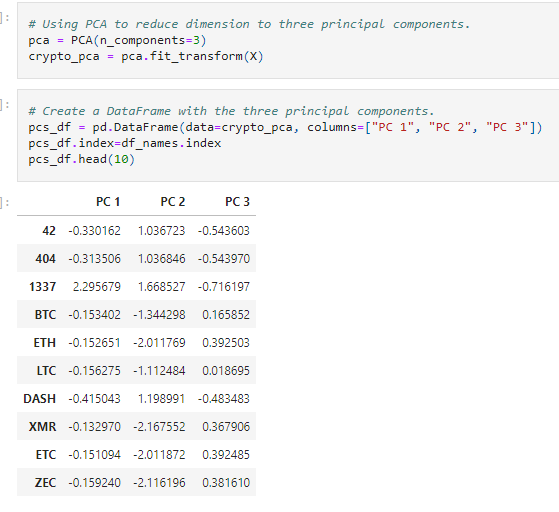
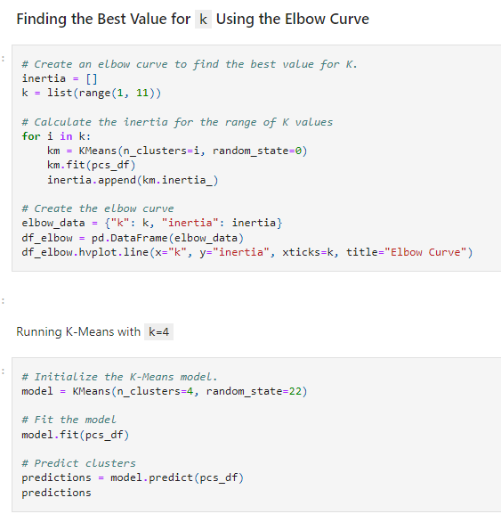
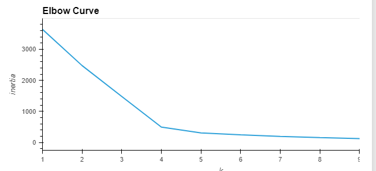
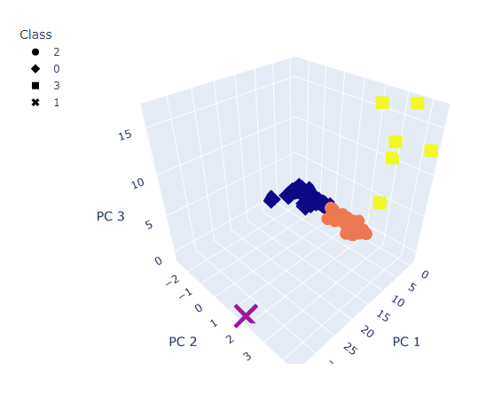
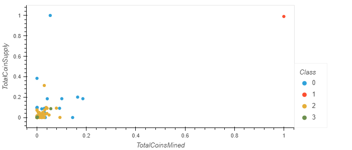

# Cryptocurrencies
Unsupervised Machine Learning and Cryptocurrencies
## Overview
The goal of this project was to process, cluster, and reduce the dimensions of Cryptocurrency data, and to reduce the principal components using PCA.

## Results
Data was preprocessed for PCA using Python in Jupyter Notebook.

### Reducing Data Dimensions Using PCA

### Clustering Cryptocurrencies Using K-means

### Visualizing Cryptocurrencies Results

